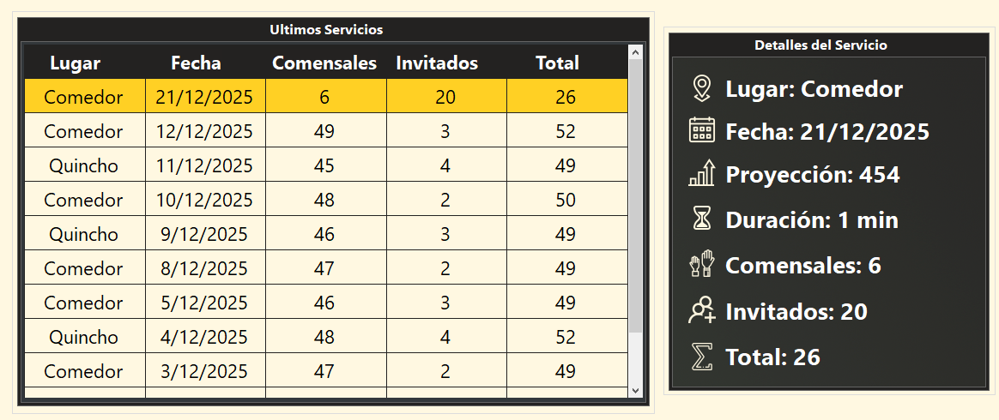
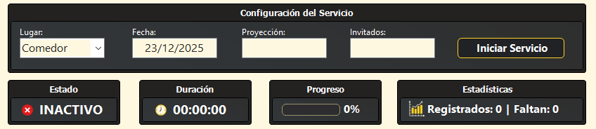
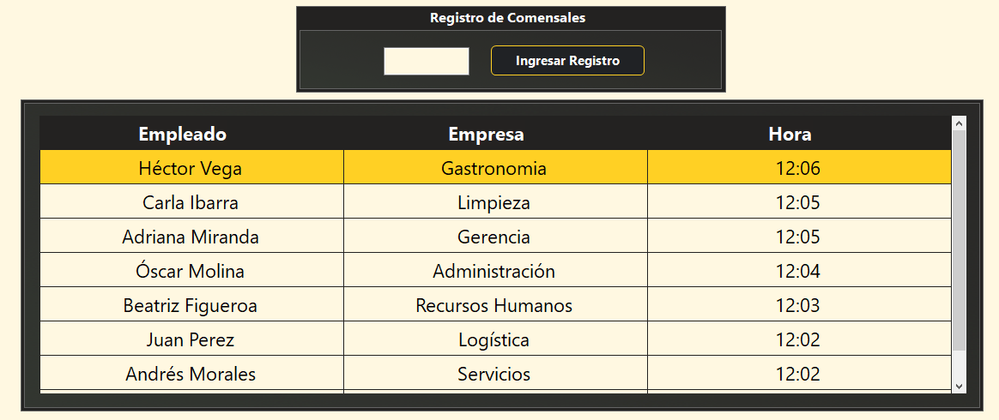
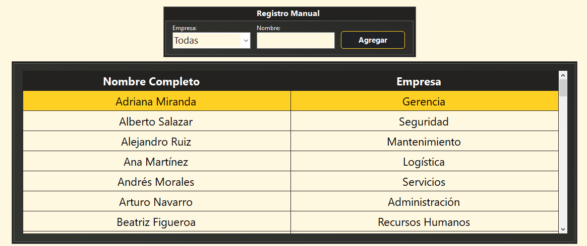
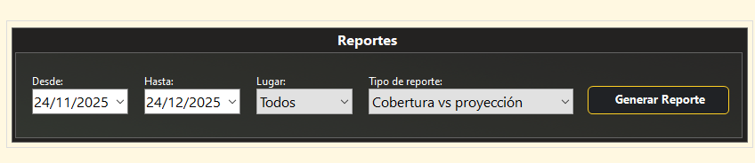
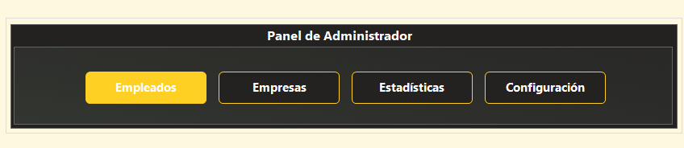
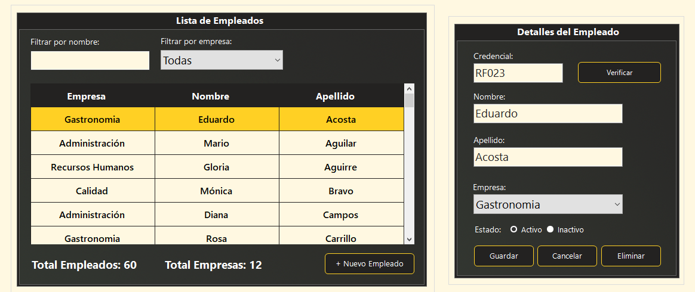
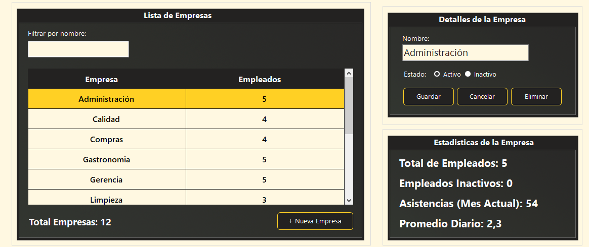
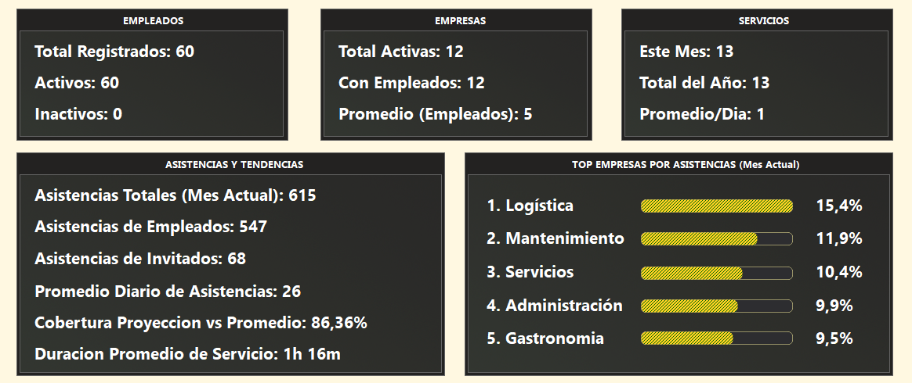
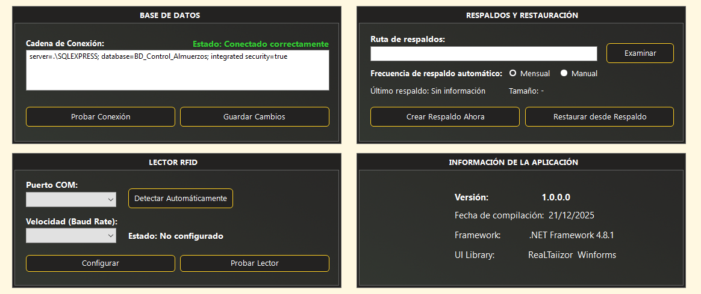

<div align="center">
  
</div>

---

Sistema completo de gestión de comedores corporativos desarrollado en C# con Windows Forms, diseñado para el registro eficiente de comensales mediante credenciales RFID y generación de reportes automáticos.


---

##  Características Principales

-  **Arquitectura de 3 capas** (Dominio, Negocio, Presentación)
-  **Registro rápido de comensales** por ID de credencial (preparado para RFID)
-  **Gestión completa de empleados y empresas** con asignación de credenciales
-  **Sistema de servicios por jornada** (comedor y quincho)
-  **Visualización en tiempo real** para personal de cocina
-  **Reportes automáticos** con exportación a PDF
-  **Estadísticas avanzadas** por empresa, período y lugar
-  **Procedimientos almacenados** para todas las operaciones críticas
-  **Validaciones robustas** (duplicados, servicio activo, estado de empleado)
-  **Interfaz moderna** con diseño personalizado
-  **Manejo de invitados** sin datos personales
-  **Registro manual alternativo** para casos sin credencial
-  **Optimizado para alta concurrencia** en horarios pico
-  **Sistema de respaldos automáticos y manuales**
-  **Panel de configuración avanzada**

##  Funcionalidades del Sistema


<table>
  <tr>
    <td width="120" style="border-radius:6px 0 0 6px; border:1px solid #ccc; border-right:none; text-align:center; vertical-align:top; padding:0;">
      
    </td>
    <td style="vertical-align:top; padding-left:16px; border:none;">
      <h3 style="margin-bottom: 0.7em;">Menú de Navegación Lateral</h3>
      El sistema cuenta con un menú lateral fijo que permite acceder rápidamente a todos los módulos:
      <ul>
        <li><b>Inicio</b>: Panel de bienvenida (sin servicio activo) o Registro de Comensales (con servicio activo)</li>
        <li><b>Registro Manual</b>: Acceso al módulo de registro manual de comensales</li>
        <li><b>Reportes</b>: Sistema de reportes y análisis estadístico</li>
        <li><b>Administración</b>: Panel administrativo</li>
      </ul>
      <b>Características de Navegación:</b>
      <ul>
        <li>Iconos intuitivos para cada módulo</li>
        <li>Tooltips informativos al pasar el cursor</li>
        <li>Indicador visual de sección activa</li>
        <li>Diseño minimalista que maximiza el espacio de trabajo</li>
        <li>Acceso rápido sin menús desplegables</li>
        <li>Navegación fluida entre módulos sin recargas</li>
      </ul>
    </td>
  </tr>
</table>

###  Panel de Bienvenida



**Lista de Últimos Servicios:**
- Visualización de los servicios más recientes
- Ordenados cronológicamente (más recientes primero)
- Información resumida: fecha, lugar, proyección
- Selección rápida de servicio para consulta

**Detalles del Servicio Seleccionado:**
- Información completa del servicio seleccionado
- Fecha y hora de inicio
- Lugar (Comedor/Quincho)
- Proyección inicial de comensales
- Total de invitados esperados
- Duración del servicio
- Total de comensales registrados
- Comparativa final proyección vs real

###  Gestión de Servicios



**Configuración e Inicio:**
- Selección de lugar (Comedor/Quincho)
- Ingreso de proyección de comensales esperados
- Registro de total de invitados estimados
- Botón para iniciar servicio
- Validación de datos antes de activar

**Panel Informativo Durante el Servicio:**
- Lugar actual del servicio activo
- Fecha y hora de inicio
- Proyección inicial configurada
- Cronómetro de duración en tiempo real (HH:mm:ss)
- Contador de comensales registrados (actualización automática)
- Total de invitados esperados
- Comparativa visual proyección vs realidad

**Finalización del Servicio:**
- Botón para cerrar servicio activo
- Cálculo automático de estadísticas finales
- Duración total, cobertura y diferencia
- Generación de registro histórico para reportes

###  Registro de Comensales



**Sistema de Registro por Credencial:**
- Campo de ingreso para ID de credencial (método actual: teclado)
- Validación inmediata al ingresar ID
- Ventana de confirmación temporal 
- Muestra: nombre completo, empresa y hora de registro

**Listado de Registros en Tiempo Real:**
- Tabla con todos los registros del servicio actual
- Columnas: nombre, empresa, hora de registro (HH:mm:ss)
- Actualización automática con cada nuevo registro
- Ordenado cronológicamente (más recientes arriba)
- Optimizado para consulta rápida del personal de cocina

**Validaciones Automáticas:**
- Verificación de empleado activo en el sistema
- Detección de registros duplicados en el servicio actual
- Vinculación automática al servicio activo del lugar
- Sincronización con contador del panel superior

###  Registro Manual de Comensales



**Método Alternativo de Registro:**
- Para empleados sin credencial asignada
- Búsqueda por nombre y/o apellido del empleado
- Filtrado en tiempo real del listado
- Selección de empleado desde la tabla de resultados
- Registro con las mismas validaciones que el sistema por credencial
- Útil para casos de pérdida, daño o falta de credencial

###  Reportes



- **Selección de tipo de reporte**: Menú desplegable con los 4 tipos disponibles
- **Generar Reporte**: Carga los datos según los filtros aplicados
- **Exportar a PDF**: Genera documento con formato profesional
- **Filtros personalizables**:
  - Rango de fechas: Desde - Hasta (con selectores de calendario)
  - Filtro por lugar: Comedor, Quincho o Todos los lugares

**Tipos de Reportes Disponibles:**

**1. Lista de Servicios**
- Todos los servicios del período seleccionado
- Fecha, lugar, proyección, duración del servicio
- Total de comensales reales vs proyección
- Total de invitados
- Total general (comensales + invitados)
- Útil para revisión histórica y análisis día por día

**2. Asistencias por Empresas**
- Total de asistencias por cada compañía del predio
- Comparativa y ranking entre empresas
- Útil para facturación segmentada por empresa
- Análisis de participación corporativa
- Identificar empresas con mayor/menor uso del comedor

**3. Cobertura vs Proyección**
- Comparación entre proyección inicial y asistencia real
- Porcentaje de cobertura por servicio
- Diferencia absoluta (positiva/negativa)
- Mejora de planificación y compras futuras

**4. Distribución por Día de Semana**
- Patrones de asistencia semanal
- Total acumulado por cada día de la semana
- Identificación de días pico y días bajos
- Optimización de compras según día
- Ajuste de proyecciones por patrón semanal

###  Panel de Administrador



Punto de acceso centralizado a todas las funciones administrativas del sistema. Presenta una interfaz que permite acceder a los siguientes módulos:

- **Empleados**: Gestión completa de empleados y asignación de credenciales
- **Empresas**: Administración de empresas del predio
- **Estadísticas**: Dashboard de análisis y métricas del sistema
- **Configuración**: Configuración del sistema, base de datos y respaldos

###  Gestión de Empleados



**Operaciones ABML Completas:**
- **Alta**: Crear nuevos empleados con datos completos
- **Baja lógica**: Desactivar empleados manteniendo historial
- **Modificación**: Actualizar información de empleados
- **Listado y Búsqueda**: Filtros por nombre, apellido, empresa

**Gestión de Credenciales:**
- Asignación de ID de credencial a empleados
- Validación de unicidad de credenciales
- Visualización de estado de credencial

**Integración con el Sistema:**
- Datos utilizados en registro de comensales
- Vinculación con empresas del predio
- Validación de estado activo para registros


###  Gestión de Empresas



**Operaciones ABML Completas:**
- **Alta**: Crear nuevas empresas con nombre y descripción
- **Baja lógica**: Desactivar empresas manteniendo historial
- **Modificación**: Actualizar información de empresas existentes
- **Listado y Búsqueda**: Filtros por nombre, estado activo/inactivo

**Visualización de Estadísticas:**
- Total de empleados por empresa
- Total de asistencias del mes actual
- Identificación de empresas sin empleados activos

**Integración con el Sistema:**
- Vinculación automática con módulo de empleados
- Estadísticas mensuales actualizadas en tiempo real
- Filtrado de registros por compañía

###  Estadísticas



Dashboard de análisis estadístico con visualización de métricas clave en tiempo real en cuatro áreas principales:

- **Métricas Generales**: Total de servicios, asistencias registradas y promedios
- **Análisis por Empresa**: Ranking de participación y distribución porcentual
- **Análisis Temporal**: Patrones de asistencia y días pico
- **Análisis de Proyección**: Precisión de estimaciones y sugerencias de mejora

###  Configuración del Sistema



Panel de administración completo que centraliza la configuración del sistema en tres áreas principales:

- **Configuración de Base de Datos**: Gestión de conexión e información del servidor SQL
- **Sistema de Respaldos**: Backups manuales y automáticos mensuales con restauración
- **Información de la Aplicación**: Versión del sistema y tecnologías utilizadas

---

##  Arquitectura del Sistema

```
Sistema-Control-Almuerzos/
├── SCA/
│   ├── dominio/                     # Capa de Entidades
│   │   ├── Empleado.cs              # Modelo de empleados
│   │   ├── Empresa.cs               # Modelo de empresas
│   │   ├── Lugar.cs                 # Modelo de lugares (comedor/quincho)
│   │   ├── Servicio.cs              # Modelo de servicios por jornada
│   │   ├── Registro.cs              # Modelo de registros de almuerzos
│   │   ├── Estadisticas.cs          # Modelos estadísticos 
│   │   ├── Reportes.cs              # Modelos de reportes 
│   │   └── Configuracion.cs         # Modelos de configuración 
│   │
│   ├── negocio/                       # Capa de Lógica de Negocio
│   │   ├── AccesoDatos.cs             # Clase centralizada para BD con IDisposable
│   │   ├── NegocioException.cs        # Excepciones personalizadas con mensajes amigables
│   │   ├── EmpleadoNegocio.cs         # Lógica de empleados
│   │   ├── EmpresaNegocio.cs          # Lógica de empresas
│   │   ├── LugarNegocio.cs            # Lógica de lugares
│   │   ├── ServicioNegocio.cs         # Lógica de servicios
│   │   ├── RegistroNegocio.cs         # Lógica de registros
│   │   ├── EstadisticasNegocio.cs     # Lógica de estadísticas
│   │   ├── ReporteNegocio.cs          # Generación de 4 reportes avanzados
│   │   ├── ConfiguracionNegocio.cs    # Lógica de configuración y respaldos
│   │   └── Mappers/                   # Conversión de DataReader a Entidades
│   │       ├── EmpleadoMapper.cs      # Mapeo de empleados
│   │       ├── EmpresaMapper.cs       # Mapeo de empresas
│   │       ├── LugarMapper.cs         # Mapeo de lugares
│   │       ├── ServicioMapper.cs      # Mapeo de servicios
│   │       ├── RegistroMapper.cs      # Mapeo de registros
│   │       └── ConfiguracionMapper.cs # Mapeo de configuración
│   │
│   └── app/                          # Capa de Presentación
│       ├── Program.cs                # Punto de entrada
│       ├── frmPrincipal.cs           # Ventana principal
│       ├── Gestores/                 # Componentes de gestión especializados 
│       │   ├── GestorCronometro.cs   # Gestión de cronómetro de servicio 
│       │   ├── GestorEstadisticas.cs # Actualización de estadísticas en tiempo real
│       │   └── GestorNavegacion.cs   # Control de navegación entre vistas 
│       ├── Helpers/                  # Utilidades de presentación
│       │   ├── MensajesConstantes.cs # ~120 constantes centralizadas 
│       │   ├── MensajesUI.cs         # Mensajes y manejo de excepciones en UI
│       │   └── ListadoHelper.cs      # Utilidades para DataGridView 
│       ├── UserControls/             # Controles de usuario modulares
│       │   ├── ucServicio.cs             # Registro por credencial RFID
│       │   ├── ucRegistroManual.cs       # Registro manual de comensales
│       │   ├── ucNotificacion.cs         # Notificación visual de registro
│       │   ├── ucEmpleados.cs            # Gestión de empleados
│       │   ├── ucEmpresas.cs             # Gestión de empresas
│       │   ├── ucConfiguracion.cs        # Configuración del sistema
│       │   ├── ucReportes.cs             # Sistema de reportes
│       │   ├── ucEstadisticas.cs         # Análisis estadístico
│       │   └── ucAdmin.cs                # Panel administrativo
│       └── Iconos/                   # Recursos gráficos
│
├── Script_Sistema_Control_Almuerzos.sql  # Script completo de BD
├── Procedimientos_Vistas_Triggers.sql    # Objetos de BD
├── Datos_Iniciales.sql                   # Datos de prueba
├── DER_SdCdA.drawio                      # Diagrama ER
├── MANUAL_USUARIO.md                     # Manual para el usuario
└── README.md                             # Este archivo
```

##  Base de Datos

### Modelo de Datos

**EMPLEADOS**
```sql
- IdEmpleado (INT, PK, Identity)
- Nombre (VARCHAR(50), NOT NULL)
- Apellido (VARCHAR(50), NOT NULL)
- IdEmpresa (INT, FK, NOT NULL)
- IdCredencial (VARCHAR(20), UNIQUE)
- Estado (BIT, DEFAULT 1)
```

**EMPRESAS**
```sql
- IdEmpresa (INT, PK, Identity)
- Nombre (VARCHAR(100), NOT NULL)
- Estado (BIT, DEFAULT 1)
```

**LUGARES**
```sql
- IdLugar (INT, PK, Identity)
- Nombre (VARCHAR(50), NOT NULL)
- Descripcion (VARCHAR(200))
- Estado (BIT, DEFAULT 1)
```

**SERVICIOS**
```sql
- IdServicio (INT, PK, Identity)
- IdLugar (INT, FK, NOT NULL)
- Fecha (DATE, NOT NULL)
- Proyeccion (INT)
- DuracionMinutos (INT)
- TotalComensales (INT, DEFAULT 0)
- TotalInvitados (INT, DEFAULT 0)
- Estado (VARCHAR(20), DEFAULT 'Activo')
```

**REGISTROS**
```sql
- IdRegistro (INT, PK, Identity)
- IdEmpleado (INT, FK, NOT NULL)
- IdEmpresa (INT, FK, NOT NULL)
- IdServicio (INT, FK, NOT NULL)
- Fecha (DATE, NOT NULL)
- Hora (TIME, NOT NULL)
- IdLugar (INT, FK, NOT NULL)
```

### Procedimientos Almacenados

#### Gestión de Empleados
- `sp_ListarEmpleados`: Listado completo con empresa y credencial
- `sp_BuscarEmpleadoPorId`: Búsqueda específica por ID
- `sp_BuscarEmpleadoPorCredencial`: Búsqueda por ID de credencial
- `sp_AltaEmpleado`: Inserción con validaciones
- `sp_ModificarEmpleado`: Actualización completa
- `sp_BajaEmpleado`: Baja lógica
- `sp_AsignarCredencial`: Asignar ID de credencial único

#### Gestión de Servicios
- `sp_IniciarServicio`: Crear nuevo servicio activo
- `sp_FinalizarServicio`: Cerrar servicio con cálculos
- `sp_ObtenerServicioActivo`: Obtener servicio en curso
- `sp_ListarServicios`: Historial de servicios

#### Gestión de Registros
- `sp_RegistrarAlmuerzo`: Registro principal con validaciones
- `sp_RegistrarInvitados`: Registro de invitados sin datos
- `sp_VerificarRegistroDuplicado`: Validar si ya se registró
- `sp_ListarRegistrosPorServicio`: Registros del servicio actual
- `sp_ContarRegistrosPorServicio`: Total de comensales

#### Reportes y Estadísticas
- `sp_ReporteDiario`: Estadísticas de un día específico
- `sp_ReportePorPeriodo`: Análisis de rango de fechas
- `sp_ReportePorEmpresa`: Datos específicos de empresa
- `sp_EstadisticasGenerales`: Resumen general del sistema
- `sp_ListarServiciosRango`: Servicios en período con filtros de lugar
- `sp_AsistenciasPorEmpresas`: Totales de asistencia por compañía
- `sp_ReporteCoberturaVsProyeccion`: Análisis de precisión de proyecciones
- `sp_DistribucionPorDiaSemana`: Patrones de asistencia semanal

#### Configuración y Administración
- `sp_ObtenerInfoBaseDatos`: Información del servidor SQL (nombre, tamaño, fechas)
- `sp_ObtenerUltimoRespaldo`: Datos del último backup realizado
- `sp_CrearRespaldo`: Crear backup manual de la base de datos
- `sp_RestaurarRespaldo`: Restaurar base de datos desde archivo de backup

### Vistas

- `vw_EmpleadosCompletos`: Vista completa de empleados con empresa
- `vw_RegistrosCompletos`: Registros con datos de empleado y empresa
- `vw_ServiciosCompletos`: Servicios con estadísticas calculadas
- `vw_EstadisticasPorEmpresa`: Agrupación de datos por compañía

### Triggers

- `tr_ActualizarTotalComensales`: Actualiza contador en SERVICIOS automáticamente
- `tr_ValidarCredencialUnica`: Valida unicidad de credenciales
- `tr_ValidarServicioActivo`: Previene múltiples servicios activos simultáneos

---

## Módulos del Sistema

| Módulo | Descripción |
|--------|-------------|
| **ucServicio** | Registro de comensales por credencial RFID | 
| **ucRegistroManual** | Registro manual seleccionando de lista | 
| **ucNotificacion** | Notificación visual animada de registro exitoso |
| **ucEmpleados** | Gestión de empleados y credenciales | 
| **ucEmpresas** | Gestión de empresas | 
| **ucConfiguracion** | Configuración del sistema y respaldos | 
| **ucReportes** | Generación de reportes con exportación PDF | 
| **ucEstadisticas** | Dashboard de análisis estadístico |
| **ucAdmin** | Panel administrativo (contenedor de módulos) | 

---

##  Características Técnicas

### Seguridad

- **Validación de entrada**: Todos los inputs son validados
- **Prevención de SQL Injection**: Uso exclusivo de parámetros y SPs
- **Manejo específico de excepciones**: SqlException en capa de negocio 
- **Transacciones seguras**: Rollback automático en errores
- **Baja lógica**: No se eliminan datos, solo se desactivan
- **Integridad referencial**: Llaves foráneas con restricciones

### Rendimiento

- **Índices optimizados**: En campos de búsqueda frecuente
- **Consultas parametrizadas**: Para mejor plan de ejecución
- **Stored Procedures**: Lógica pre-compilada en servidor
- **Mappers optimizados**: Conversión eficiente de DataReader a entidades
- **Filtrado en base de datos**: Reducción de datos transferidos
- **Actualización eficiente**: Solo datos necesarios en tiempo real
- **Gestores especializados**: Separación de responsabilidades para mejor mantenibilidad

### Validaciones Implementadas

**A Nivel de Base de Datos:**
-  Unicidad de credenciales (Triggers)
-  Integridad referencial (FK Constraints)
-  Validación de servicio único activo (Triggers)
-  Actualización automática de contadores (Triggers)

**A Nivel de Negocio:**
-  Empleado debe estar activo
-  No puede registrarse dos veces en el mismo servicio
-  Debe existir un servicio activo para registrar
-  Credencial debe ser única al asignar
-  No se puede cerrar un servicio sin inicio

**A Nivel de Presentación:**
-  Campos obligatorios marcados
-  Formato de datos validado
-  Mensajería centralizada con constantes (MensajesConstantes)
-  Confirmaciones antes de operaciones críticas
-  Feedback visual inmediato
-  Gestores especializados para cronómetro, estadísticas y navegació

---

##  Documentación

### Documentos Disponibles

| Documento | Descripción | Ubicación |
|-----------|-------------|-----------|
| **README.md** | Documentación técnica completa (este archivo) | Raíz del proyecto |
| **MANUAL_USUARIO.md** | Guía para usuarios finales del sistema | Raíz del proyecto |
| **Guia_Implementacion_RFID.md** | Guía para implementar lector RFID | Raíz del proyecto |
| **DER_SdCdA.drawio** | Diagrama Entidad-Relación editable | Raíz del proyecto |
| **Script_Sistema_Control_Almuerzos.sql** | Script completo de creación de BD | Raíz del proyecto |
| **Procedimientos_Vistas_Triggers.sql** | Objetos de BD detallados | Raíz del proyecto |
| **Datos_Iniciales.sql** | Datos de prueba para testing | Raíz del proyecto |

### Guías Específicas

**Para Desarrolladores:**
- Leer este README completo
- Revisar arquitectura en sección correspondiente
- Consultar `NegocioException.cs` para manejo de errores en capa de negocio
- Consultar `MensajesUI.cs` para manejo de mensajes y excepciones en UI
- Revisar carpeta `Mappers/` para conversión de datos

**Para Usuarios:**
- Leer `MANUAL_USUARIO.md`
- Revisar flujos de trabajo comunes
- Consultar sección de Preguntas Frecuentes

---

##  Herramientas y Tecnologías Utilizadas

### Desarrollo del Sistema

**IDE y Entorno de Desarrollo:**
- **Visual Studio 2022 Community Edition** - Desarrollo de aplicación Windows Forms
- **SQL Server Management Studio (SSMS) 19** - Gestión de base de datos
- **Draw.io Desktop** - Diseño del Diagrama Entidad-Relación

**Frameworks y Librerías:**
- **.NET Framework 4.8** - Framework principal de la aplicación
- **System.Data.SqlClient** - Conectividad con SQL Server
- **ReaLTaiizor 3.8.1.3** - Componentes de interfaz modernos y personalizados
- **iTextSharp 5.5.13.4** - Generación de reportes PDF
- **BouncyCastle.Cryptography 2.4.0** - Dependencia de iTextSharp

**Base de Datos:**
- **SQL Server 2019 Express Edition** - Motor de base de datos
- **Transact-SQL (T-SQL)** - Lenguaje de consultas y procedimientos almacenados

### Documentación y Guías

Las siguientes herramientas fueron utilizadas para la elaboración de documentación técnica, guías de usuario, y asistencia en la estructuración del código:

- **GitHub Copilot** (Claude Sonnet 4.5)
  - Generación de documentación técnica (README.md)
  - Elaboración de manual de usuario (MANUAL_USUARIO.md)
  - Creación de guía de implementación RFID
  - Asistencia en refactorización de código
  - Sugerencias de mejores prácticas
  - Optimización de procedimientos almacenados
  - Revisión de consultas SQL complejas
  - Generación de casos de prueba

**Control de Versiones:**
- **Git** - Control de versiones local
- **GitHub** - Repositorio remoto y colaboración

**Edición de Documentos:**
- **Visual Studio Code** - Edición de archivos Markdown
- **Markdown Preview Enhanced** - Vista previa de documentación

### Nota sobre el uso de IA

El uso de herramientas de IA generativa fue exclusivamente para:
- **Documentación**: Redacción clara y profesional de guías
- **Refactorización**: Mejora de estructura y legibilidad del código existente
- **Consultoría**: Validación de soluciones técnicas y mejores prácticas
- **Patrones de diseño**: Sugerencias para organización de código (Mappers, Helpers, Gestores)

**Toda la lógica de negocio, arquitectura del sistema, diseño de base de datos y funcionalidades fueron desarrolladas por el autor del proyecto.**

---

##  Enlaces Útiles

- [Repositorio en GitHub](https://github.com/f-Rra/Sistema-Control-Almuerzos)
- [Documentación de .NET Framework](https://docs.microsoft.com/en-us/dotnet/framework/)
- [SQL Server Documentation](https://docs.microsoft.com/en-us/sql/sql-server/)
- [ReaLTaiizor UI Components](https://github.com/Taiizor/ReaLTaiizor)
- [iTextSharp Documentation](https://github.com/itext/itextsharp)

---

**Facundo Herrera**
- Estudiante de Tecnicatura Universitaria en Programación
- Universidad Tecnológica Nacional - Facultad Regional General Pacheco (UTN-FRGP)
- Email: Facundo.herrera@alumnos.frgp.utn.edu.ar

---

